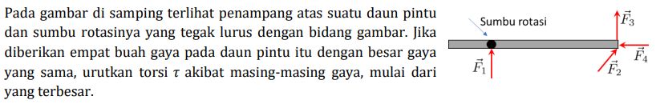

# a02

## hint
+ $\vec{\tau} = \vec{r} \times \vec{F}$.
+ $\tau = |\vec{\tau}| = \sqrt{\vec{\tau} \cdot \vec{\tau}}$.
+ $\cos\theta = \angle (\vec{\vec{r}}, {\vec{F}})$.
+ $\sin^2 \theta = 1 - \cos^2 \theta$.
+ $\tau = r F \sin \theta = r_{\perp} F$.
+ $r \sin\theta \equiv r_{\perp}$.

$i$ | $\vec{F}_i$ | $\vec{r}_i$ | $\theta_i$ | $\vec{r}_i \times \vec{F}_i$
:-: | :-: | :-: | :-: | :-:
$1$ | $F \ (\hat{y}$) | $0$ | $-$ | 
$2$ | $F \ (\cos\theta \ \hat{x} + \sin\theta \ \hat{y})$ | $l \ \hat{x}$ | $\theta$ | 
$3$ | $F \ (\hat{y})$ | $l \ \hat{x}$ | $\frac12 \pi$ | 
$4$ | $F \ (-\hat{x})$ | $0$ | $-$ | 

## answer
+ ..