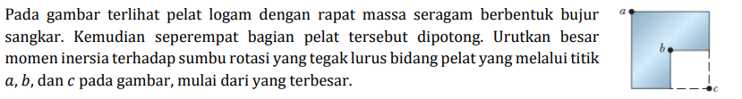
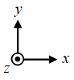

# a03

## hint
+ $\displaystyle M = \sum_{i = 1}^N m_i$.
+ $\vec{r}_i = x_i \hat{x} + y_i \hat{y}$.
+ $\displaystyle \vec{r} \_{\rm com} = \frac{1}{M} \int \vec{r} \ dm \equiv \frac{1}{M} \sum_{i = 1}^N \vec{r}_i m_i$.
+ $\displaystyle I = \int r_\perp^2 dm \equiv \sum_i r_\perp^2 m_i $.
+ $I_z = \frac{1}{12} M ( l_x^2 + l_y^2)$, $l_x = l_y = l$.
+ $I = I_{\rm com} + M h^2$.
+ @SW $\Box$ .

$N$ | $m_i$ | $x_i$ | $y_i$
:-: | :-: | :-: | :-:
$3$ | $\frac14 M$, $\frac14 M$, $\frac14 M$ | $\frac14 l$, $\frac14 l$, $\frac34l$ | $\frac14 l$, $\frac34 l$, $\frac34 l$
$2$ | $M$, $-\frac14 M$ | $\frac12 l$, $\frac34 l$ | $\frac12 l$, $\frac14 l$

## answer
+ ..
