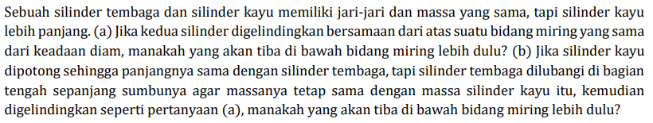

# a05

## hint
+ $I_z = \frac12 M R^2$.
+ $M = \int \rho dV$
+ $\rho = \rho(r, \theta, \varphi)$.
+ $dV = (dr)(r d\theta)(r \sin\theta d\phi) = r^2 \sin\theta d\theta d\varphi$.
+ $\rho_{\rm Cu} = 8.96 \ {\rm g/cm^3}$.
+ $\rho_{\rm wood} = (0.50 - 0.90) \ {\rm g/cm^3}$.

## answer
+ ..