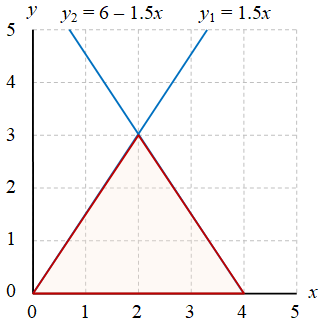

# area-triangle
calculate area of triangle

## formula
Suatu segitiga dengan panjang alas $l$ dan tinggi $t$ akan memiliki luas

$$\tag{1}
A = \tfrac12 lt.
$$

## triangle
+ Gambar 1. Segitiga dengan alas $l = 4$ dan tinggi $t = 3$. \
  
+ Gambar 2. Segitiga dengan alas $l = 4$ dan tinggi $t = 3$, alas berhimpit pada sumbu $x$ dan ujung kiri pada pusat koordinat. \
  
+ Gambar 3. Segitiga dengan alas $l = 4$ dan tinggi $t = 3$, alas sejajar dengan sumbu $x$. \
  
+ Gambar 4. Segitiga dengan alas $l = 4$ dan tinggi $t = 3$, alas berhimpit pada sumbu $y$. \
  

## dicussion
1. Tunjukkan bahwa dengan menggunakan $A = \int \int dy \ dx$ ketiga gambar terakhir akan memberikan hasil luas segitiga yang sama seperti diberikan Persamaan (1).
2. Manakah menurut pendapat Anda cara yang paling sederhana dari kasus pada Gambar 2 - 4? Jelaskan alasannya.