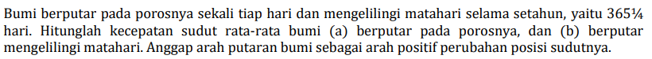

# b01

## hint
+ $\displaystyle \omega = \frac{v}{R}$.
+ $l_\circ = C = 2 \pi R = v T$.
+ $R_\oplus = 6371 \  {\rm km}$.
+ $r_{\odot - \oplus} = 149.597871 \times 10^6 \ {\rm km} = 1 \ {\rm AU}$.
+ $1 \ {\rm y} = 365.25 \ {\rm d}$.
+ $1 \ {\rm d} =  24 \ {\rm h}$.
+ $1 \ {\rm h} = 60 \ {\rm min}$.
+ $1 \ {\rm min} = 60  \ {\rm s}$.

## answer
+ ..