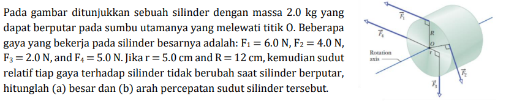

# b05

## hint
+ $\vec{\tau}_i = \vec{r}_i \times \vec{F}_i$.
+ $\sum \vec{\tau} = I \vec{\alpha}$.
+ $\hat{r} \times \hat{\theta} = \hat{z}$.
+ $I = \frac12 M R^2$.

$i$ | $\vec{r}_i$ (m) | $\vec{F}_i$ (N) | $\vec{\tau}_i$
:-: | :-: | :-: | :-:
1 | $R \ (\hat{r})$ | $F_1 \ (\hat{\theta})$ |
2 | $R \ (\hat{r})$ | $F_2 \ (-\hat{\theta})$ |
3 | $r \ (\hat{r})$ | $F_3 \ (-\hat{\theta})$ |
4 | $0 \ (\hat{r})$ | $F_4 \ (\hat{r})$ |

## answer
+ ..