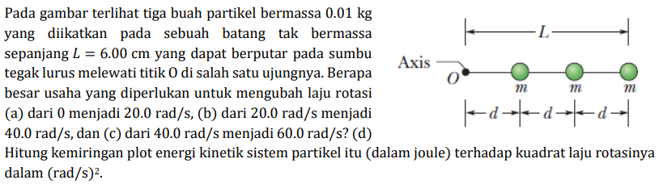

# b06

## hint
+ $L = 3d$.
+ $\displaystyle I = \sum_{i = 1}^3 r_{\perp, i}^2 \ m_i$.
+ $\displaystyle W = \int \vec{\tau} \cdot d\vec{\theta}$.
+ $\Delta K = \frac12 I \omega_f^2 - \frac12 I \omega_i^2$.
+ $\Delta K = W$.
+ $\displaystyle \frac{dK}{d\omega^2} = \tfrac12 I$.

$i$ | $r_{\perp, i}$ | $m_i$
:-: | :-: | :-:
1 |  $d$ | $m$
2 | $2d$ | $m$
3 | $3d$ | $m$

## answer
+ ..