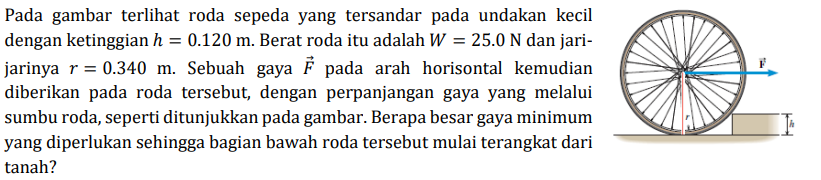

# b08

## hint
+ $\displaystyle \sum F_x = 0$.
+ $\displaystyle \sum F_y = 0$.
+ $\displaystyle \sum \tau = 0$.
+ $\vec{\tau} = \vec{r} \times \vec{F}$.
+ $w = mg$.
+ $N = 0$.
+ $\displaystyle \cos\theta = \frac{r - h}{r}$.

## answer
+ ..