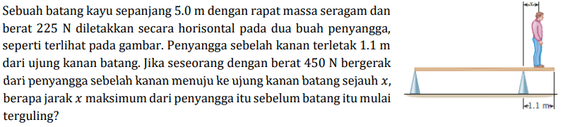

# b10

## hint
+ $\displaystyle \sum F_y = 0$.
+ $w = mg$.
+ $x_C = x_A + \frac12 L$, $x_B = x_A + L - l = 0$, $x_P = x$.
+ $N_A$, $N_B$, $N_P$, $w_C$.
+ $\displaystyle \sum \tau_i = 0$, $i = A, B, C, P$.

## answer
+ ..