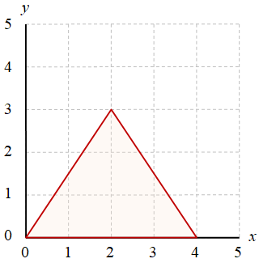
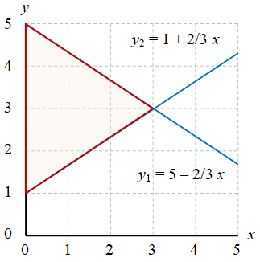

# triangle-area
calculate area of triangle

## formula
Suatu segitiga dengan panjang alas $l$ dan tinggi $t$ akan memiliki luas

$$\tag{1}
A = \tfrac12 lt.
$$

## area
Luas suatu area dalam koordinat kartesian dihitung melalui

$$\tag{2}
A = \int dA = \int \int (dx) (dy)
$$

dan dalam koordinat polar

$$\tag{3}
A = \int dA = \int \int (dr) (r d\theta).
$$

## triangle
+ Gambar 1. Segitiga dengan alas $l = 4$ dan tinggi $t = 3$. \
  
+ Gambar 2. Segitiga dengan alas $l = 4$ dan tinggi $t = 3$, alas berhimpit pada sumbu $x$ dan ujung kiri pada pusat koordinat. \
  
+ Gambar 3. Segitiga dengan alas $l = 4$ dan tinggi $t = 3$, alas sejajar dengan sumbu $x$. \
  
+ Gambar 4. Segitiga dengan alas $l = 4$ dan tinggi $t = 3$, alas berhimpit pada sumbu $y$. \
  

## dicussion
1. Tunjukkan bahwa dengan menggunakan Persamaan (2) keempat gambar sebelummya akan memberikan hasil luas segitiga yang sama.
2. Manakah menurut pendapat Anda cara yang paling sederhana dari kasus pada Gambar 2 - 4? Jelaskan alasannya.